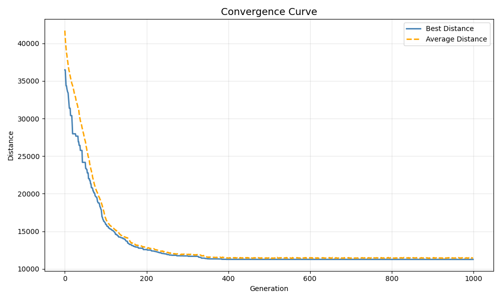
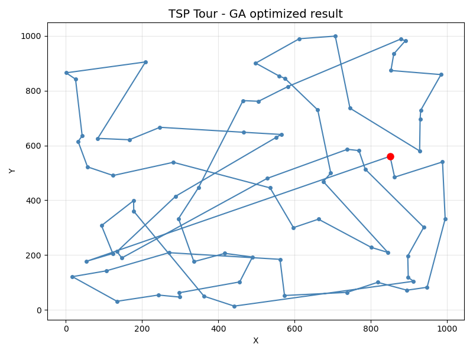
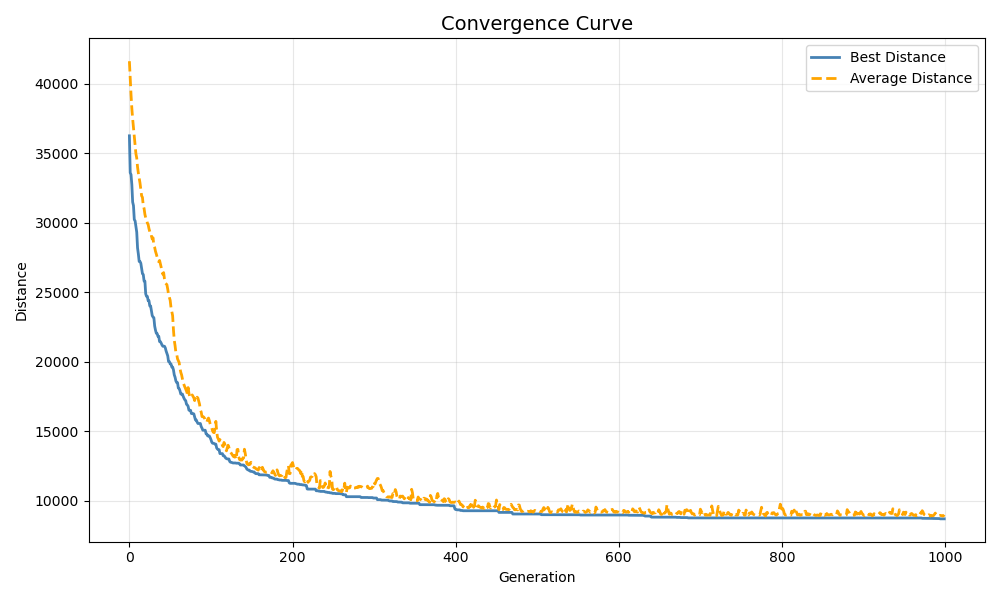
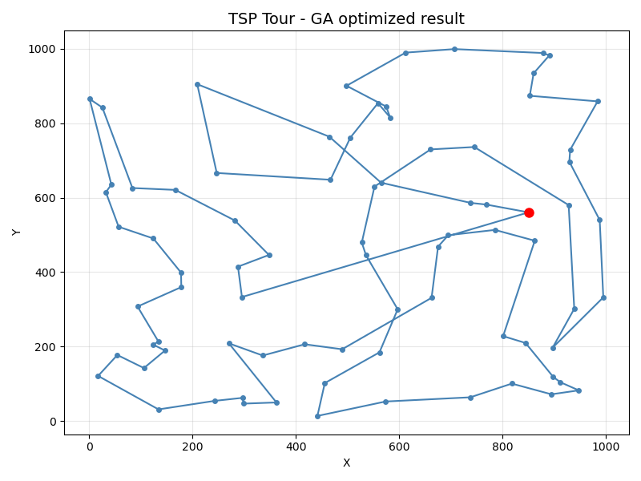
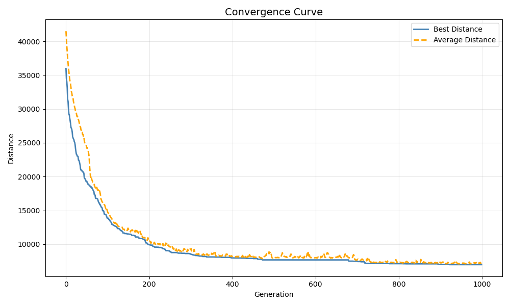
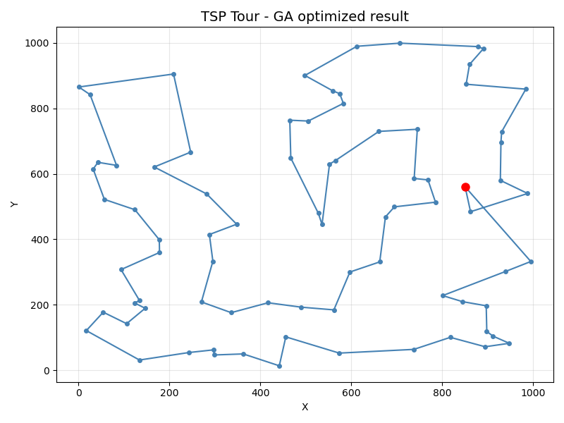
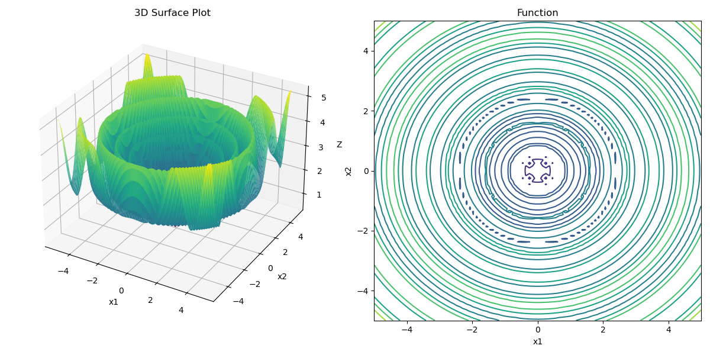
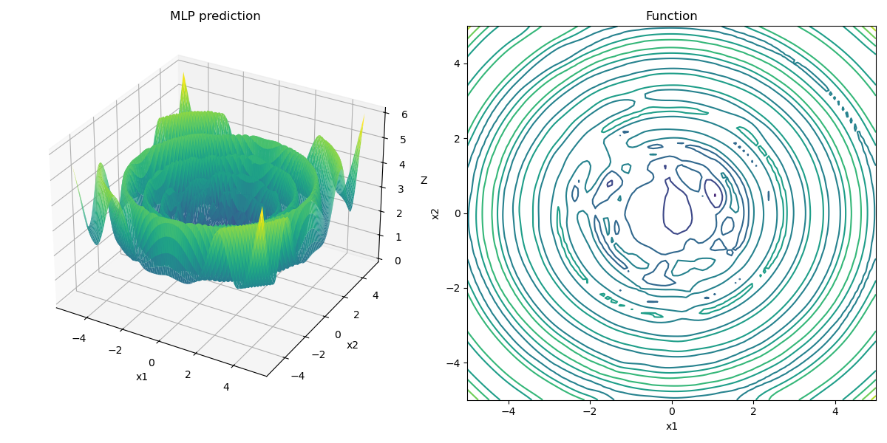
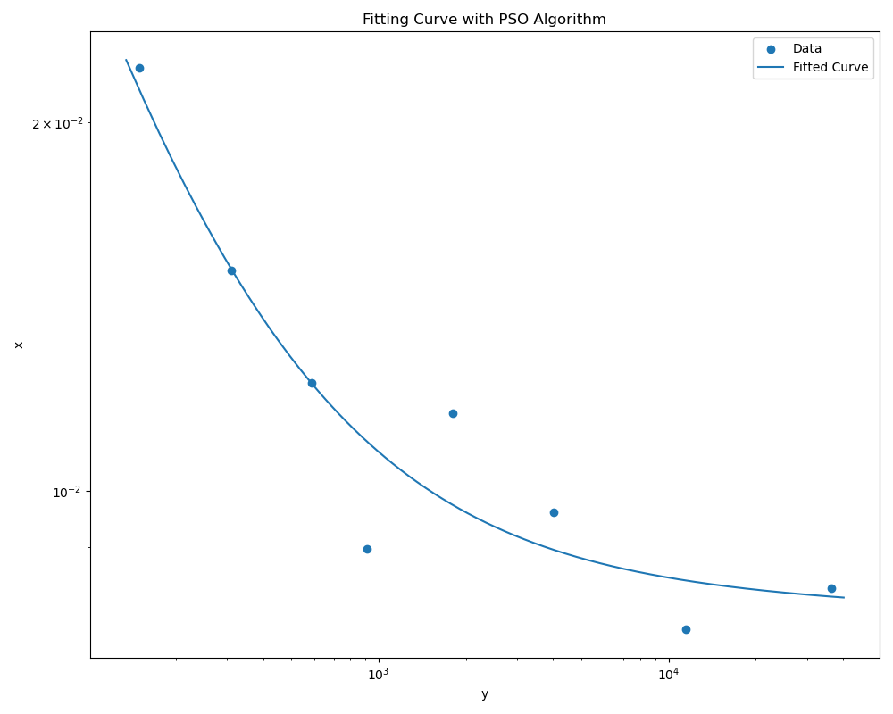

具体题目描述在每个问题文件夹中有 README 

### 题目2 

1.  不采用自适应变异， 同时不采用疫苗时 : 

```python
best_seq = tsp(cities,
        n_population=700,
        n_generations=1000,
        mutate_rate=0.2,
        elitism_rate=0.4,
        use_immune=False,
        n_immune=10,
        immune_elite_rate=0.15,  # use first 15% as top layer
        cross_algorithm='PMX',
        mutation_algorithm='normal'
    )
```

结果为 : 

```shell
Minimum distance in group:  11263.888702592736
Best sequence:  [ 0 18 55 76 35 70 59 40 38 67 32 36 17 45 71 78 77 75 23 34 62 47 51 58
 79  2  3 14 41 31 42 39  1 16 66 56  5  8 50  9 13 28 64 19  7 53 68 29
 27 30 61 21 26 49  4 63 12 37 11 48 33 20 57 69 25  6 10 15 43 46 73 54
 65 72 22 60 44 74 24 52]
```

收敛曲线如下 : 


最终路径如下 :  




当采用分层疫苗接种时， 即仅设置 `use_immune=True` ,  结果为 : 

```shell
Minimum distance in group:  8696.501031370508
Best sequence:  [ 0 15 10 33 58 63 11 48 79 50  2  9  8  5 56  3 14 41 31 42 39  1 55 76
 73 46 16 66 13 20  6 29 68 67 75 72 38 40 59 70 35 65 54 19  7 18 43 28
 64 53 23 34 62 32 22 78 77 71 45 17 52 36 25 24 69 74 60 44 30 61 21 26
  4 49 12 37 27 51 57 47]
```

显然， 使用疫苗将最终路径长度从 11264 减少到了 8696, 显著提升了最终的收敛效果。 

其收敛曲线和路径分别为 : 





但是如果采用自适应变异办法， 则可以获取到最优的结果， 即自适应变异对于后期搜索收敛非常重要， 采用如下配置 ( `mutation_algorithm='adaptive'` ) :   

```shell
best_seq = tsp(cities,
        n_population=700,
        n_generations=1000,
        mutate_rate=0.2,
        elitism_rate=0.4,
        use_immune=True,
        n_immune=10,
        immune_elite_rate=0.15,  # use first 15% as top layer
        cross_algorithm='PMX',
        mutation_algorithm='adaptive'
    )
```

得到目前的最佳结果约为 6980 左右 : 

```
Minimum distance in group:  6980.318679212413 
Best sequence:  [ 0 18 55 16  1 39 42 31 41 14  3 56  5  8 50  9  2 79 58 48  6 29 20 33
 13 66 10 15 43 28 64 53 68 67 23 34 62 32 47 57 51 27 37 11 63  4 49 12
 26 21 61 30 44 60 74 69 24 25 36 52 17 45 71 77 78 22 72 75 38 40 59 70
 35 65 54 73 19  7 46 76]
```





虽然上述图像应当还有更优解， 但是应当可以通过增加代数来达到， 该图结果已经为比较优化的结果。 

### 题目3 

训练过程迭代输出 :  

```shell
torch.Size([2000, 2]) torch.Size([2000])
epoch:  0 loss:  0.5682784914970398
epoch:  100 loss:  0.41453665494918823
epoch:  200 loss:  0.38940805196762085
epoch:  300 loss:  0.35017839074134827
epoch:  400 loss:  0.367119699716568
epoch:  500 loss:  0.14435255527496338
epoch:  600 loss:  0.05648289620876312
epoch:  700 loss:  0.023599792271852493
epoch:  800 loss:  0.006914088502526283
epoch:  900 loss:  0.023795221000909805
Average Train loss:  0.00012471895024646074
Average Test loss:  0.00010004115029005334
```

The real function is: 



the predicted function is:  




### 题目4 

采用粒子群算法进行优化求解 :

参数设置如下 : 

- 粒子群大小 : 500
- 迭代次数 : 1000

```python
best_p, best_err = pso_algorithm(yp,xp,
                                     lim_min,
                                     lim_max,
                                     inertia=0.8,
                                     c1=2,
                                     c2=2,
                                     swarm_size=500,
                                     epochs=1000) 
```

得到最终各个参数的拟合结果为 : 

```shell
Best Parameters: [ 0.0086986  -0.00692268  1.         -0.86885857]  
Best Error: 0.0020 # 实际为 0.002042 左右 
```

即由粒子群方法得到疲劳曲线拟合公式为 : 
$$
x = 0.0086986 \times y^{-0.00692268 } + 1 \times y^{-0.86885857}
$$

绘制拟合曲线如下 : 

