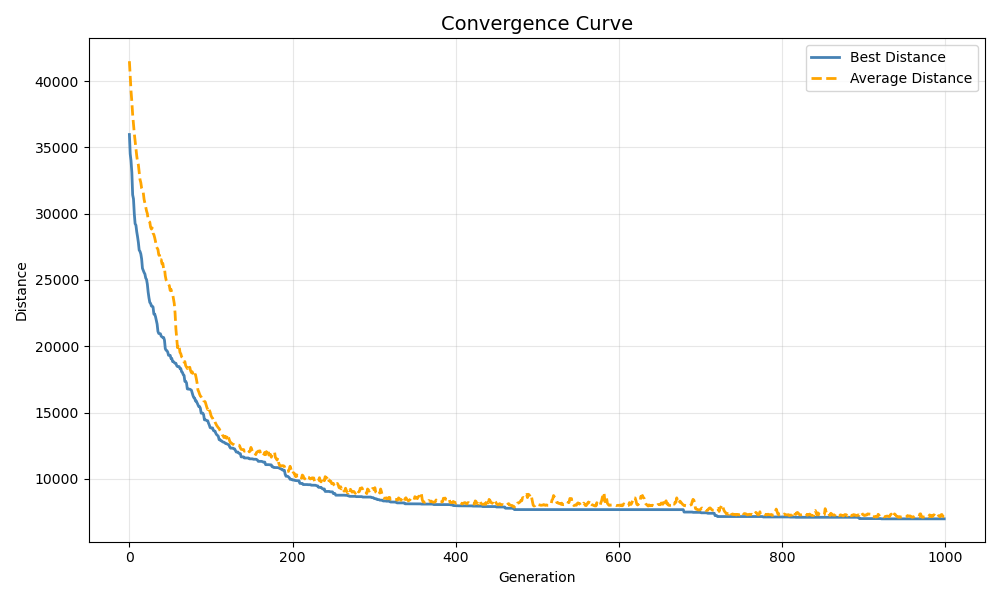
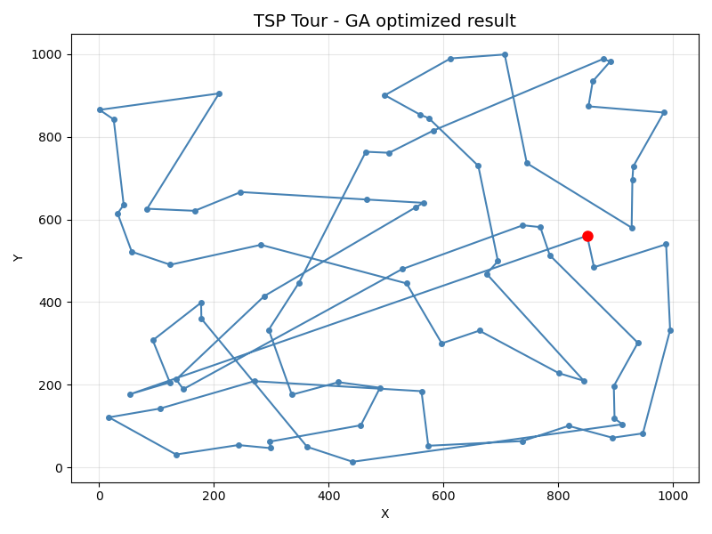

## 智能优化算法及应用作业习题2 

本项目使用遗传算法（GA）解决旅行商问题（TSP），并加入了免疫系统优化机制以提高求解质量。

## 主要功能

- **核心算法**：
  - 遗传算法框架（选择、交叉、变异）
  - 两种交叉算子：PMX（部分映射交叉）和OX（顺序交叉）
  - 两种变异策略：普通交换变异和自适应变异（交换/插入/倒置）

- **特色优化**：
  - 免疫系统机制：通过"疫苗"（城市交换对）优化种群
  - 精英保留策略：保护优质个体
  - 收敛曲线可视化：追踪算法优化过程

## 使用方法
1. 准备城市坐标数据（cities.csv）
2. 运行main()函数开始优化
3. 查看输出的最优路径图和收敛曲线

## 依赖环境
- Python 3.12
- numpy, pandas, matplotlib

## 输出结果
- 最优TSP路径的可视化图
- 算法收敛曲线（最优解和平均解随迭代的变化）

## 参数调整
可在tsp()函数中调整：
- 种群大小
- 迭代次数
- 变异率
- 精英保留比例
- 是否启用免疫优化等参数


---

Following are some test parameters and results:   

```python
best_seq = tsp(cities,
        n_population=700,
        n_generations=1000,
        mutate_rate=0.1,
        elitism_rate=0.4,
        use_immune=True,
        n_immune=10,
        immune_elite_rate=0.15,  # use first 15% as top layer
        cross_algorithm='OX',
        mutation_algorithm='normal'
        )
```

output is : 
```shell 
# the result of running exm2.py :
# using non-adaptive mutation and vaccine
Epoch:  999 Minimum distance:  9818.96293116281
```


**We note that, the adaptive mutation is very beneficial to the optimization process of TSP problem.**

With this consideration, I asked ChatGPT about adaptive mutation for better results and find the following solution : 

```python 
best_seq = tsp(cities,
        n_population=700,
        n_generations=1000,
        mutate_rate=0.2,
        elitism_rate=0.4,
        use_immune=True,
        n_immune=10,
        immune_elite_rate=0.15,  # use first 15% as top layer
        cross_algorithm='OX',
        mutation_algorithm='adaptive'
    )
```

output is :  
```shell 
Minimum distance in group:  7306.101345812422
Best sequence:  [76 46 73 54 65 35 70 59 40 19  7 53 68 67 38 23 34 75 72 22 78 77 71 62
 32 25 69 24 36 45 17 52 74 60 44 47 57 51 27 30 61 21 26 12 37 11 49  4
 63 58 79  2  9 50  8  5 56  3 14 41 31 42 39  1 66 13 33 20 48  6 29 64
 28 10 15 43 18  0 16 55] 
```

which picture is following: 


also the following parameters are tested: 
```shell
best_seq = tsp(cities,
        n_population=700,
        n_generations=1000,
        mutate_rate=0.2,
        elitism_rate=0.4,
        use_immune=True,
        n_immune=10,
        immune_elite_rate=0.15,  # use first 15% as top layer
        cross_algorithm='PMX',
        mutation_algorithm='adaptive'
    )
```

This method **hit the best solution** in 1000 generations. 
```
Minimum distance in group:  6980.318679212413 
Best sequence:  [ 0 18 55 16  1 39 42 31 41 14  3 56  5  8 50  9  2 79 58 48  6 29 20 33
 13 66 10 15 43 28 64 53 68 67 23 34 62 32 47 57 51 27 37 11 63  4 49 12
 26 21 61 30 44 60 74 69 24 25 36 52 17 45 71 77 78 22 72 75 38 40 59 70
 35 65 54 73 19  7 46 76]
```

which is plotted as following: 


and the best path is: 


----

The following is two results compared in the exam sheet: 

1. non-adaptive mutation and no vaccine use:
```python
best_seq = tsp(cities,
        n_population=700,
        n_generations=1000,
        mutate_rate=0.2,
        elitism_rate=0.4,
        use_immune=False,
        n_immune=10,
        immune_elite_rate=0.15,  # use first 15% as top layer
        cross_algorithm='PMX',
        mutation_algorithm='normal'
    )
```

the result is: 
```shell
Minimum distance in group:  11263.888702592736
Best sequence:  [ 0 18 55 76 35 70 59 40 38 67 32 36 17 45 71 78 77 75 23 34 62 47 51 58
 79  2  3 14 41 31 42 39  1 16 66 56  5  8 50  9 13 28 64 19  7 53 68 29
 27 30 61 21 26 49  4 63 12 37 11 48 33 20 57 69 25  6 10 15 43 46 73 54
 65 72 22 60 44 74 24 52]
```

convergence curve is:


path image is:



2. non-adaptive mutation and vaccine use:

```python
best_seq = tsp(cities,
        n_population=700,
        n_generations=1000,
        mutate_rate=0.2,
        elitism_rate=0.4,
        use_immune=True,
        n_immune=10,
        immune_elite_rate=0.15,  # use first 15% as top layer
        cross_algorithm='PMX',
        mutation_algorithm='normal'
    )
```

the result is: 
```shell
Minimum distance in group:  8696.501031370508
Best sequence:  [ 0 15 10 33 58 63 11 48 79 50  2  9  8  5 56  3 14 41 31 42 39  1 55 76
 73 46 16 66 13 20  6 29 68 67 75 72 38 40 59 70 35 65 54 19  7 18 43 28
 64 53 23 34 62 32 22 78 77 71 45 17 52 36 25 24 69 74 60 44 30 61 21 26
  4 49 12 37 27 51 57 47] 
```

convergence curve is: 


path image is: 


