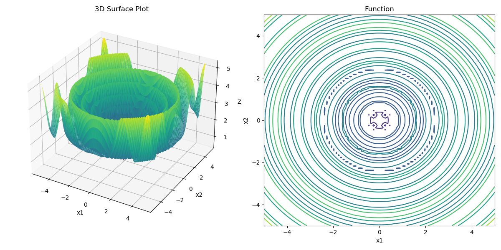
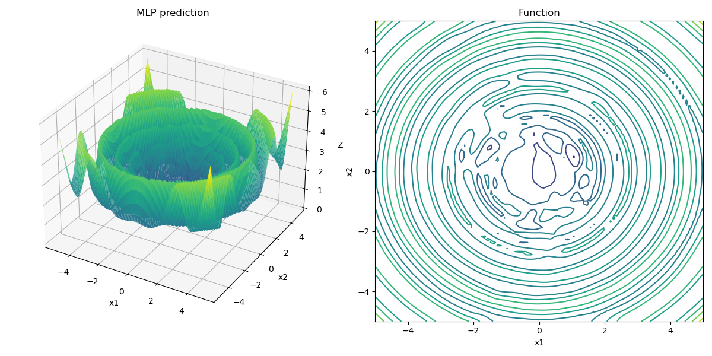

## task3 - MLP Regression 

In this task, we will implement a simple MLP regression model using PyTorch. 

The task is to train a model to fit a simple function. 

train procedure:

```shell
torch.Size([2000, 2]) torch.Size([2000])
epoch:  0 loss:  0.5682784914970398
epoch:  100 loss:  0.41453665494918823
epoch:  200 loss:  0.38940805196762085
epoch:  300 loss:  0.35017839074134827
epoch:  400 loss:  0.367119699716568
epoch:  500 loss:  0.14435255527496338
epoch:  600 loss:  0.05648289620876312
epoch:  700 loss:  0.023599792271852493
epoch:  800 loss:  0.006914088502526283
epoch:  900 loss:  0.023795221000909805
Average Train loss:  0.00012471895024646074
Average Test loss:  0.00010004115029005334
```


The real function is: 



and the predicted function is:  

